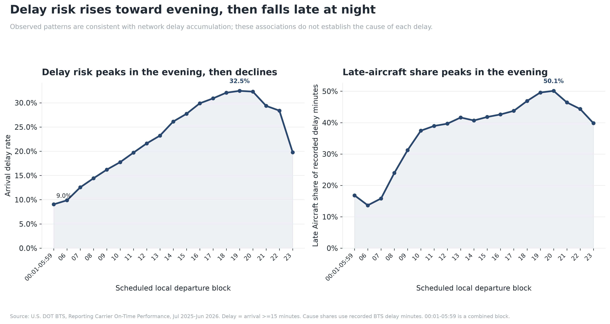
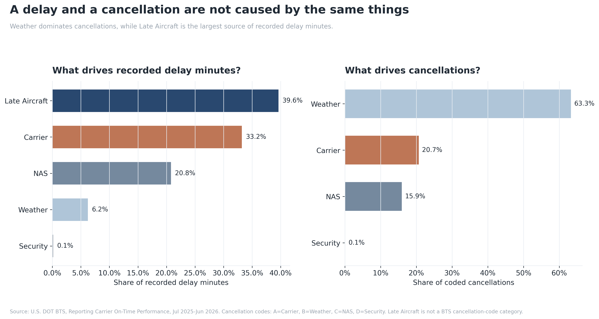
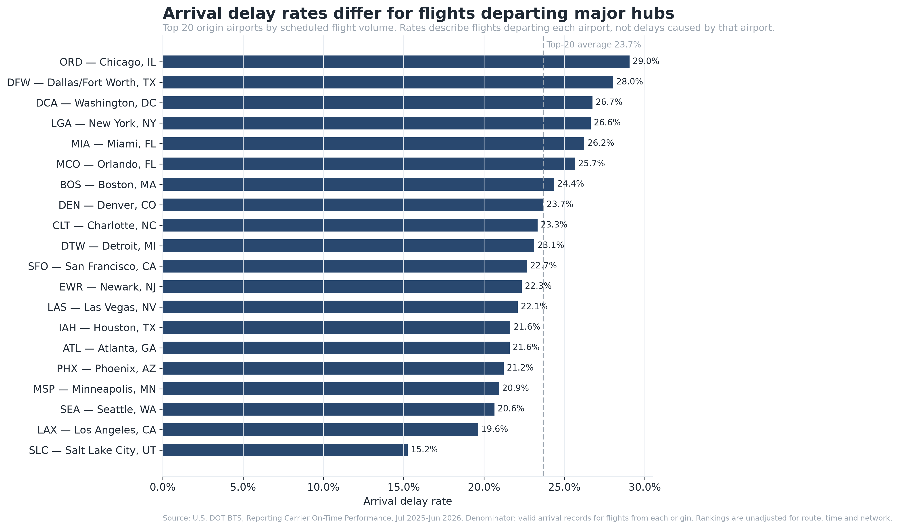
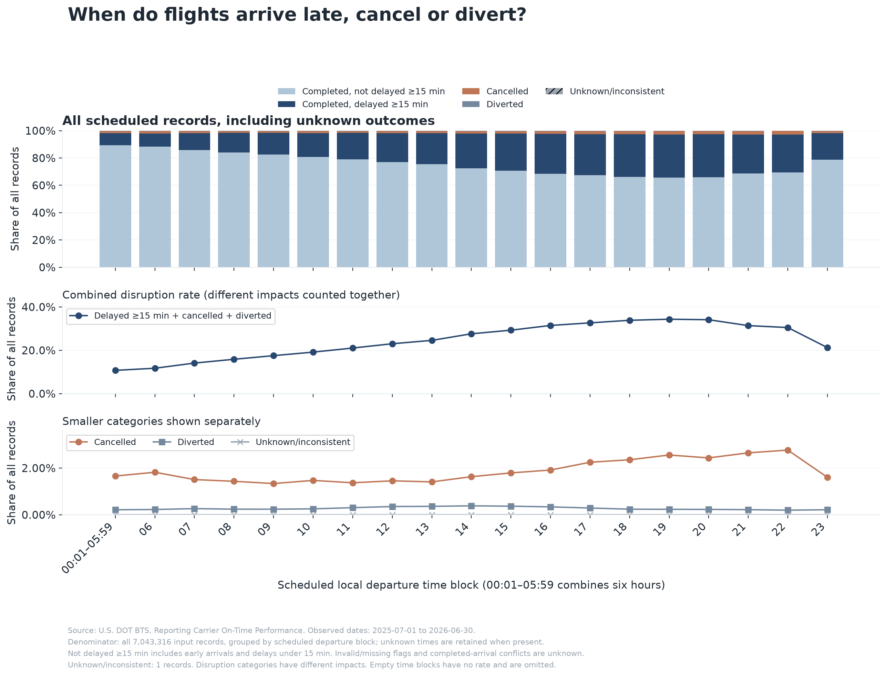

# U.S. Flight Delay Analysis

## Why Is My Flight Late?
### The Hidden Anatomy of U.S. Flight Delays

This project analyzes **7,043,316 U.S. domestic flights** to understand when delays occur, what causes them, and how delay patterns differ across airlines, airports, and time.

The analysis uses official data from the **U.S. Bureau of Transportation Statistics (BTS)** covering **July 2025 through June 2026**.

Rather than simply ranking airlines or airports, the project focuses on a broader question:

> **Why is my flight late?**

---

## Who this is for

This project is for U.S. domestic travelers with time-sensitive plans and some choice of departure time. For example, a missed connection could disrupt an appointment or work commitment; this is an illustrative scenario, not a passenger story observed in these data.

The figures describe historical associations. An earlier flight can be worth considering, but it is not a guarantee and may bring additional transport, lodging or care costs.

## Research Questions

The project is organized around seven connected questions:

1. **When do delays happen?**
   - How does delay risk vary by month and time of day?

2. **What causes flight disruptions?**
   - What drives recorded delay minutes?
   - Are cancellations caused by the same factors?

3. **How do airlines differ?**
   - How much do delay rates vary across carriers?
   - Do airlines have different delay-cause profiles?

4. **How do airports differ?**
   - How much does delay risk vary across major airports?
   - Do airports have different operational delay structures?

5. **When is the best time to fly?**
   - How does delay risk vary jointly by day of week and departure time?

6. **Can delayed flights recover time?**
   - Do longer flights recover more delay before arrival?

7. **Does the time pattern survive a broader definition of disruption?**
   - When cancellations and diversions are included, do early departures still look more reliable?

---

## Dataset

**Source:** U.S. Department of Transportation, Bureau of Transportation Statistics  
**Dataset:** Reporting Carrier On-Time Performance  
**Period:** July 1, 2025 - June 30, 2026

BTS data portal:

https://www.transtats.bts.gov/DL_SelectFields.aspx?QO_fu146_anzr=&gnoyr_VQ=FGJ

### Dataset Summary

| Item | Value |
|---|---:|
| Flight records | 7,043,316 |
| Variables | 40 |
| Time coverage | 365 days |
| Geographic scope | U.S. domestic flights |

The original BTS data were downloaded as monthly files and combined into one annual dataset.

The primary analysis file is:

```text
data/bts_2025_07_to_2026_06.csv
```

Because the merged CSV is approximately **1.5 GB**, it is not stored directly in the Git repository. The merged dataset (not a fully cleaned dataset) is distributed separately through **GitHub Releases**.

---

## Key Variables

| Variable | Description |
|---|---|
| `FL_DATE` | Flight date |
| `OP_UNIQUE_CARRIER` | Operating airline |
| `ORIGIN` | Origin airport |
| `DEST` | Destination airport |
| `DEP_TIME_BLK` | Scheduled departure time block |
| `DEP_DELAY` | Departure delay in minutes |
| `ARR_DELAY` | Arrival delay in minutes |
| `ARR_DEL15` | Arrival delay of at least 15 minutes |
| `CANCELLED` | Cancellation indicator |
| `CANCELLATION_CODE` | BTS cancellation reason |
| `DIVERTED` | Diversion indicator |
| `DISTANCE` | Flight distance |
| `CARRIER_DELAY` | Carrier-related delay minutes |
| `WEATHER_DELAY` | Weather-related delay minutes |
| `NAS_DELAY` | National Airspace System delay minutes |
| `SECURITY_DELAY` | Security-related delay minutes |
| `LATE_AIRCRAFT_DELAY` | Late-arriving aircraft delay minutes |

A delayed flight is primarily defined as:

```text
ARR_DEL15 = 1
```

meaning the flight arrived at least **15 minutes late**.

---

## Project Structure

```text
us-flight-delay-analysis/
│
├── analysis/
│   ├── _config.py
│   ├── 01_data_quality.py
│   ├── 02_rq1_monthly_delay_rate.py
│   ├── 03_rq1_delay_by_time_of_day.py
│   ├── 04_rq2_delay_vs_cancellation_causes.py
│   ├── 05_rq2_monthly_delay_cause_mix.py
│   ├── 06_rq3_airline_delay_rates.py
│   ├── 07_rq3_airline_delay_fingerprints.py
│   ├── 08_rq4_airport_delay_rates.py
│   ├── 09_rq4_airport_delay_fingerprints.py
│   ├── 10_rq5_best_time_to_fly.py
│   ├── 11_rq6_delay_recovery_by_distance.py
│   ├── 12_flight_outcomes_by_time.py
│   ├── _flight_outcomes.py
│   └── _quality.py
│
├── chart_data/
│   ├── 01_data_quality_summary.csv
│   ├── 02_rq1_monthly_delay_rate.csv
│   ├── 03_rq1_delay_by_time_of_day.csv
│   ├── 04_rq2_delay_vs_cancellation_causes.csv
│   ├── 05_rq2_monthly_delay_cause_mix.csv
│   ├── 06_rq3_airline_delay_rates.csv
│   ├── 07_rq3_airline_delay_fingerprints.csv
│   ├── 08_rq4_airport_delay_rates.csv
│   ├── 09_rq4_airport_delay_fingerprints.csv
│   ├── 10_rq5_best_time_to_fly.csv
│   └── 11_rq6_delay_recovery_by_distance.csv
│
├── charts/
│   ├── 02_rq1_monthly_delay_rate.png
│   ├── 03_rq1_delay_by_time_of_day.png
│   ├── 04_rq2_delay_vs_cancellation_causes.png
│   ├── 05_rq2_monthly_delay_cause_mix.png
│   ├── 06_rq3_airline_delay_rates.png
│   ├── 07_rq3_airline_delay_fingerprints.png
│   ├── 08_rq4_airport_delay_rates.png
│   ├── 09_rq4_airport_delay_fingerprints.png
│   ├── 10_rq5_best_time_to_fly.png
│   └── 11_rq6_delay_recovery_by_distance.png
│
├── data/
│   └── bts_2025_07_to_2026_06.csv
│
├── merge_bts_to_csv.py
├── merge_bts.py
├── requirements.txt
├── .gitignore
└── README.md
```

Each visualization follows the same reproducible structure:

```text
analysis code
      ↓
aggregated chart data
      ↓
final visualization
```

---

## Analysis Overview

| # | Research Question | Analysis |
|---|---|---|
| 01 | Data Quality | Validate records, dates, airlines, airports, and overall rates |
| 02 | RQ1: When? | Monthly arrival delay rate |
| 03 | RQ1: When? | Delay risk by scheduled departure time |
| 04 | RQ2: Why? | Delay causes vs cancellation causes |
| 05 | RQ2: Why? | Monthly delay-cause mix |
| 06 | RQ3: Airlines | Airline arrival delay rates |
| 07 | RQ3: Airlines | Airline delay fingerprints |
| 08 | RQ4: Airports | Major-airport arrival delay rates |
| 09 | RQ4: Airports | Airport delay fingerprints |
| 10 | RQ5: When to fly? | Day × departure-time heatmap |
| 11 | RQ6: Recovery | Delay recovery by flight distance |
| 12 | RQ7: Passenger outcomes | All-record outcome shares by scheduled departure block |

---

Additional files: `tests/` contains small regression fixtures; [methods and reproduction details](docs/METHODS.md) describe quality reports, outcome definitions, all 40 source fields and rebuilding from monthly ZIPs.

## Main Findings

### 1. Delays are common but not evenly distributed

Approximately **22.4%** of flights with valid arrival records arrived at least 15 minutes late.

Monthly delay rates also vary noticeably, showing that delay risk is not constant throughout the year.

---

### 2. Delay risk rises toward evening, then declines

Morning flights have the lowest observed delay rates.

Among flights with valid arrival-delay records, the rate rises from **9.9% at 06:00–06:59** to **32.5% at 19:00–19:59**, then falls to **19.8% at 23:00–23:59**. It does not increase throughout the entire day.

At the same time, the share of delay minutes attributed to **Late Aircraft Delay** also increases later in the day.

This pattern is consistent with disruption accumulating as aircraft move through multiple flights during the day. It does not identify the cause of each evening delay.



---

### 3. Delays and cancellations have different causes

Recorded delay minutes are approximately distributed as:

| Cause | Share |
|---|---:|
| Late Aircraft | 39.6% |
| Carrier | 33.2% |
| NAS | 20.8% |
| Weather | 6.2% |
| Security | 0.1% |

Late Aircraft is the largest source of recorded delay minutes.

However, **weather accounts for roughly 63% of coded cancellations**. Cause shares use recorded delay minutes; cancellation shares use coded cancellations, a different denominator. The Weather category should not be interpreted as a measurement of all system-wide weather impacts.



This creates an important distinction:

> **A cancellation and a delay may look similar to a passenger, but operationally they are different problems.**

---

### 4. Late Aircraft Delay is persistent

Late Aircraft remains one of the largest sources of recorded delay minutes throughout the full 12-month period.

Its monthly share stays roughly between **35% and 42%**, suggesting that the overall result is not driven by a single unusual month.

---

### 5. Airlines have different delay fingerprints

Airline arrival-delay rates differ meaningfully, with major carriers spanning roughly **18% to 27%**.

However, a simple ranking does not explain why.

Different airlines show different combinations of:

- Carrier Delay
- Weather Delay
- NAS Delay
- Security Delay
- Late Aircraft Delay

The same observed delay rate can therefore reflect different operational problems.

---

### 6. Airport context matters

Major U.S. airports also show large differences in delay rates.

Among large airports in the dataset, observed arrival-delay rates range from approximately **15% to 29%**. These are final arrival-delay rates for flights **departing** each origin airport, not the percentage of delays caused by that airport. Airline and airport rankings do not control for route, departure time, season or network differences, so they are not causal rankings of management quality.



Airport delay fingerprints further show that different hubs experience different combinations of network, carrier, weather, and airspace-related delays.

---

### 7. Time of day is the clearest practical takeaway

The day × departure-time heatmap shows a strong and consistent pattern:

> **Earlier flights are generally less likely to be delayed than later flights.**

Day of week also changes delay risk, but the time-of-day pattern is stronger.

This makes departure time one of the most practical findings for passengers.

---

### 8. Longer flights recover slightly more time

For flights that departed late but completed normally:

| Distance | Average time recovered |
|---|---:|
| <500 miles | ~4 min |
| 500-999 miles | ~5 min |
| 1000-1499 miles | ~5 min |
| 1500-1999 miles | ~7 min |
| 2000+ miles | ~9 min |

Longer flights recover somewhat more delay before arrival, although the effect is modest.

---

### 9. Including cancellations and diversions preserves the broad time pattern

The new `flight_outcome` feature assigns every record to one of five mutually exclusive categories. The full-data run counted 5,350,236 completed flights not delayed by 15 minutes, 1,546,047 completed delayed flights, 127,324 cancellations, 19,708 diversions and **1 unknown/inconsistent record**.

| Scheduled local departure block | Previous arrival-delay rate¹ | Combined disruption rate² |
|---|---:|---:|
| 00:01–05:59 (combined block) | 9.0% | 10.7% |
| 06:00–06:59 | 9.9% | 11.7% |
| 19:00–19:59 | 32.5% | 34.3% |
| 23:00–23:59 | 19.8% | 21.2% |

¹ Denominator: records with a valid arrival-delay flag. ² Denominator: **all records in the block**; numerator: completed delayed flights + cancellations + diversions. These disruptions have different passenger impacts; summing them does not make their costs equivalent. Unknowns remain in the denominator and are shown separately.



The broader measure still rises toward evening and falls late at night. This supports a bounded practical suggestion to consider earlier departures when feasible, not a claim that rescheduling any individual flight will produce the same improvement. The underlying data contain no unknown departure blocks; the code retains such a block whenever one occurs.

Sources: [by-time counts](chart_data/12_flight_outcomes_by_time.csv), [global counts](chart_data/12_flight_outcomes_global.csv), [classification checks](chart_data/12_flight_outcomes_checks.csv).

## Methodology

### Arrival Delay Rate

Arrival delay rate is calculated using flights with `ARR_DEL15` equal to 0 or 1. The older analysis scripts select nonmissing flags; the new full-data audit verified that all nonmissing flags in this release are legal, making these selections equivalent for this release:

```text
Arrival Delay Rate
=
Flights with ARR_DEL15 = 1
/
Flights with valid ARR_DEL15
```

Cancelled flights are therefore not counted as normal on-time arrivals.

### Data quality and preprocessing

The full Release CSV was audited on September 20, 2026: **7,043,316 rows, 40 fields, all 365 expected dates and 12 expected months**. No invalid 0/1 flags, completed-arrival minute/flag conflicts, out-of-range dates, full-row hash repeats or candidate-flight-key hash repeats were found. One noncancelled, nondiverted record lacks `ARR_DEL15` and `ARR_DELAY`; it is retained as unknown, not treated as on time.

See [detailed checks](chart_data/01_data_quality_checks.csv), [monthly counts](chart_data/01_data_quality_monthly_counts.csv) and [missing-date report](chart_data/01_data_quality_missing_dates.csv). Empty missing-date output means no dates were missing. Global duplicate detection uses a temporary SQLite index of 64-bit hashes; hash collisions and differences in textual formatting are limitations, so these are screening results rather than proof of semantic uniqueness.

No records are automatically deleted. Missing arrival fields on cancelled flights can be structural; absent cause minutes are not automatically data corruption. Negative delay minutes represent early operations and are retained, as are extreme delays. Filling missing cause minutes with zero is only a summation convention, not evidence that the true contribution was zero. Full classification and missing-value rules are in [METHODS.md](docs/METHODS.md).

### Engineered features

`flight_outcome` combines validated cancellation/diversion flags with the arrival-delay flag; completed-flight minute/flag conflicts become unknown. A valid arrival-delay flag remains usable when arrival-delay minutes are missing. `Completed, not delayed ≥15 min` includes early arrivals and delays under 15 minutes.

`recovery_minutes = DEP_DELAY - ARR_DELAY` measures schedule recovery among late-departing, completed flights. The existing distance bins are [0, 500), [500, 1000), [1000, 1500), [1500, 2000) and [2000, infinity) miles. They support descriptive comparison, not causal estimates of route length. `DAY_OF_WEEK` and `DEP_TIME_BLK` are supplied by BTS, not newly engineered features.

### Delay-Cause Shares

BTS cause variables represent recorded delay minutes:

```text
Cause Share
=
Recorded minutes for a cause
/
Total recorded delay minutes
```

These percentages represent the distribution of recorded delay minutes, not the percentage of all scheduled flights caused by each category.

### Cancellation Codes

| Code | Cause |
|---|---|
| A | Carrier |
| B | Weather |
| C | National Airspace System |
| D | Security |

Late Aircraft is a delay category but is not a BTS cancellation-code category.

### Airport Analysis

Airport analysis uses the **origin airport**.

- Top 20 origin airports by scheduled flight volume are used for delay-rate comparison.
- Top 10 are used for airport delay fingerprints.

### Delay Recovery

Recovery is defined as:

```text
Recovery Minutes = DEP_DELAY - ARR_DELAY
```

The recovery analysis includes flights that:

- departed late,
- were not cancelled,
- were not diverted.

---

## Reproducing the Analysis

### 1. Clone the repository

```bash
git clone https://github.com/canyangxu/us-flight-delay-analysis.git
cd us-flight-delay-analysis
```

### 2. Install dependencies

```bash
python3 -m venv .venv
source .venv/bin/activate
python -m pip install -r requirements.txt
```

### 3. Download the dataset

Download:

```text
bts_2025_07_to_2026_06.csv
```

from the [v1.0-data Release](https://github.com/canyangxu/us-flight-delay-analysis/releases/tag/v1.0-data) and place it in:

```text
data/bts_2025_07_to_2026_06.csv
```

For rebuilding from the original monthly ZIPs, see the field list, folder layout and optional DuckDB workflow in [METHODS.md](docs/METHODS.md).

### 4. Validate the dataset

```bash
python analysis/01_data_quality.py
```

Coverage verified in the full-data run:

```text
7,043,316 records
2025-07-01 through 2026-06-30
```

### 5. Run the analyses

```bash
python analysis/02_rq1_monthly_delay_rate.py
python analysis/03_rq1_delay_by_time_of_day.py
python analysis/04_rq2_delay_vs_cancellation_causes.py
python analysis/05_rq2_monthly_delay_cause_mix.py
python analysis/06_rq3_airline_delay_rates.py
python analysis/07_rq3_airline_delay_fingerprints.py
python analysis/08_rq4_airport_delay_rates.py
python analysis/09_rq4_airport_delay_fingerprints.py
python analysis/10_rq5_best_time_to_fly.py
python analysis/11_rq6_delay_recovery_by_distance.py
python analysis/12_flight_outcomes_by_time.py
```

Each analysis produces:

```text
chart_data/<matching summary data>.csv
charts/<matching visualization>.png
```

---

### 6. Run regression tests

```bash
# Optional for the Parquet merge and its regression test only:
python -m pip install duckdb
python -m unittest discover -s tests -v
```

Tests use temporary input/output directories. They cover classification edge cases, chunk equivalence, cross-chunk duplicates, unknown times, count conservation, empty-input/undefined rates and safe merging. The full release was used to run scripts 01, 03, 08 and 12; their reports and three regenerated figures are included. The remaining analyses were not rerun. The monthly-to-CSV/Parquet rebuild was tested on small ZIP fixtures, not independently reconstructed from 12 newly downloaded monthly files.

## Limitations

This project is a **descriptive analysis** of observed BTS flight operations.

The results identify patterns and associations but do not establish causal effects.

- Findings are limited to this year, U.S. domestic operations and the reporting-carrier dataset's coverage; they do not predict an individual flight.
- One row represents one flight, not a passenger-weighted measure of disruption.
- Unadjusted airline/airport comparisons reflect routes, schedules, season and network structure as well as other factors; avoid assigning blame from these rankings.
- Arrival-only rates omit cancellations and other flights without arrival records. The outcome analysis adds those records to the denominator, while keeping unknowns visible.
- Early departures may impose transport, accommodation, work or caregiving costs and may not be available to all travelers.
- A descriptive time association does not establish the improvement any traveler would obtain by changing departure time.

For example, the increase in both overall delay risk and Late Aircraft Delay later in the day is consistent with disruption accumulating through the network, but the data alone do not prove that every evening delay was directly caused by an earlier flight.

---

## Core Takeaway

> **A flight delay is rarely just about one flight.**

Delay risk changes across time, airlines, airports, and operational conditions.

The delay experienced by a passenger at one gate may have started hours earlier somewhere else in the aviation network.

---

## Data Source

U.S. Department of Transportation  
Bureau of Transportation Statistics  
Reporting Carrier On-Time Performance

https://www.transtats.bts.gov/